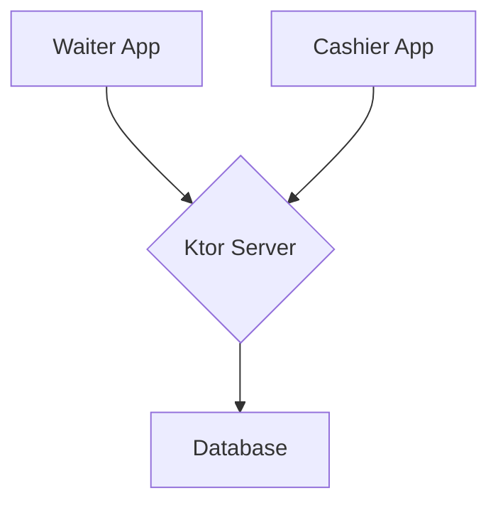

# Comanda

Comanda is a modern, end-to-end restaurant management system designed to streamline the ordering process. It consists of a mobile app for waiters, a desktop app for cashiers, and a central backend server. This project showcases a complete, multi-platform ecosystem built with the latest Kotlin technologies.

##  Project Goals

- **📱 Waiter App (Android):** Allows waiters to manage tables, take orders, and send them to the kitchen in real-time.
- **💻 Cashier App (Desktop):** Enables cashiers to manage the menu, view incoming orders, and process payments.
- **🌐 Server (Ktor):** A central backend that handles data synchronization, authentication, and business logic.

##  Features

- **Real-time Synchronization:** Orders and table statuses are updated in real-time across all devices using WebSockets.
- **User Authentication:** Secure JWT-based authentication for waiters and cashiers.
- **Offline Support:** The waiter app will support offline order creation and synchronization.
- **Modern UI:** A clean and intuitive user interface built with Jetpack Compose and Material 3.

##  Technologies & Libraries

This project is built with a modern technology stack, showcasing the power of Kotlin for end-to-end development.

### Waiter App (Android)

| Library | Version |
|---|---|
| Kotlin | 2.0.21 |
| Jetpack Compose BOM | 2024.09.00 |
| Activity Compose | 1.8.0 |
| Lifecycle KTX | 2.6.1 |
| Navigation Compose | 2.7.7 |
| Core KTX | 1.10.1 |
| Material 3 | 1.6.0 |
| Koin | 4.1.1 |

### Badges

##  Architecture

The system is designed with a client-server architecture. The backend is handled by a **Ktor Server**, which manages data and communication.

The client applications (**Waiter App** and **Cashier App**) are built following the **MVVM (Model-View-ViewModel)** architecture pattern, implementing a **UDF (Unidirectional Data Flow)** to ensure a predictable and maintainable state management. **Koin** is used for dependency injection to manage the lifecycle of components like ViewModels and Repositories.

##  Project Structure

This project is a monorepo containing the following modules:

- `waiter-app/`: The Android application for waiters.
- `cashier-app/`: The desktop application for the cashier.
- `server/`: The Ktor backend.

